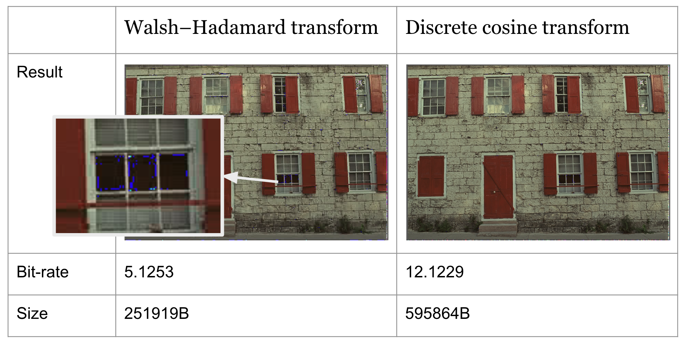

# Image compression with WHT & DCT algorithms

---

## Introduction

In this project, we implemented the Walsh–Hadamard Transform (WHT) and Discrete Cosine Transform (DCT) as image 
compression algorithms. Then, We test the code with the Kodak dataset and compare the results.

## Requirements

You can refer to [requirements.txt](requirements.txt) in install the requirements for python.

## How to run

1. Dataset

We use public kodak dataset. You can find it [here](https://www.kaggle.com/datasets/sherylmehta/kodak-dataset/data). 

Create folders like this
```
root
|---data
|   |---kodak
|   |   \---*.png
|   \---kodak_result
|---main.py
|---example.ipynb
...
```
and put the PNG images in `/data/kodak`

2. Example

We provided an [example](example.ipynb) to go through our code and result.

3. Full result

You can also run `python main.py` to get the full result, including all result images, their size and bitrate.

## Results

1. Comparison of Results
    
   In this section, we do a basic level comparison with some examples of compressed images. A more detailed statistical comparison will follow later. 
  
   
  
   Therefore, WHT may produce visually worse results than DCT, but it has a lower bitrate, implying reduced storage requirements.

2. Conclusion
    
- Advantages

    First, WHT and DCT are context independent, meaning there is no necessity to store individualized transform matrices for each image. 
    
    Second, the computational complexity is low. Since the pipeline mainly contains matrix multiplication, the process is suitable for GPU acceleration
    
    Third, the quantization settings are flexible. By creating groups of quantization matrices with varying quantization ratios, the compression ratio can be adjusted according to the users' needs.

- Limitations

    Both transforms are not optimal in terms of information carrying capacity compared to the Karhunen–Loève transform (KLT), which is optimal but computationally demanding.

## Reference
- DCT (discrete cosine transform) functions for pytorch [GitHub](https://github.com/zh217/torch-dct.git)
- Kodak dataset [Kaggle](https://www.kaggle.com/datasets/sherylmehta/kodak-dataset/data)