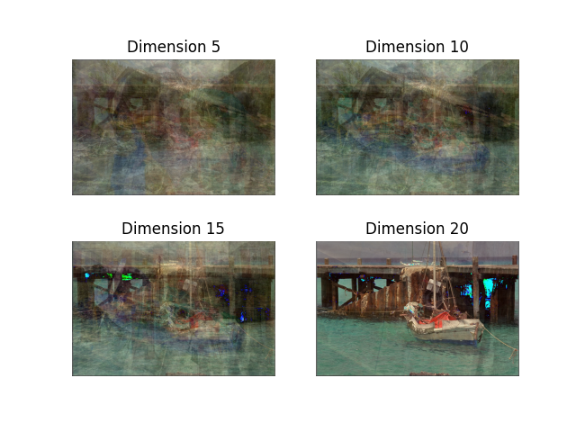
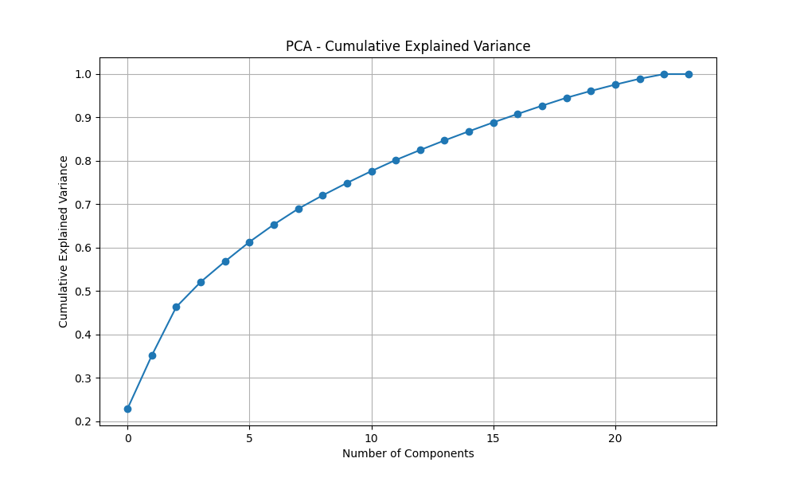
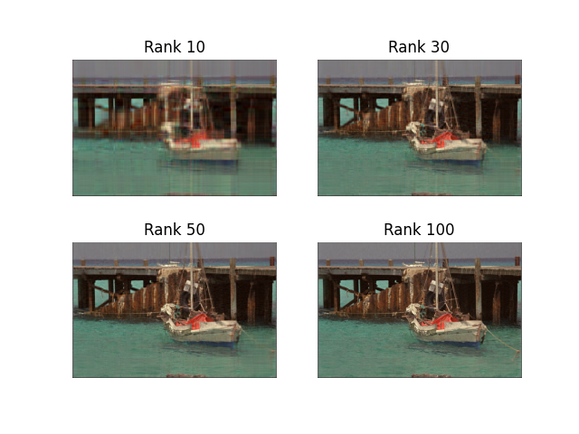
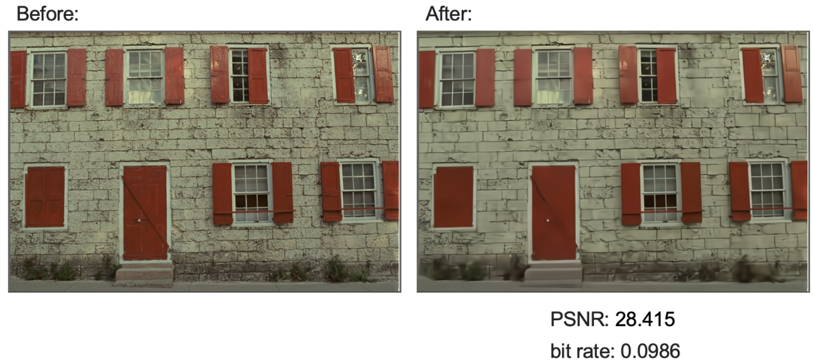
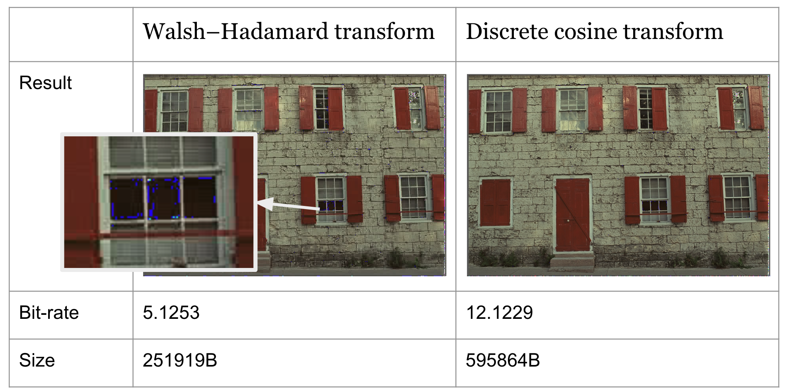

# image_compression

In this project, we initially explore the linear algebraic methods using Singular Value Decomposition (SVD), Principle Components Analysis (PCA), Walsh–Hadamard Transformation (WHT) and Discrete Cosine Transformation (DCT) to extract important components of images and then we look at a AI-based state of art image compression called MLIC++.

We perform experiments on Kodak image dataset, composing of 24 pieces of lossless, true color (24 bits per pixel, aka "full color") images (You can find the image dataset here: https://r0k.us/graphics/kodak/).

The structure of this repository:
- PCA&SVD: fold contains the code to perform PCA and SVD
- WHT&DCT: fold contains the code to perform WHT and DCT, see more [README](./DCT&WHT/README.md)
- SOTA: fold contains the code to perform SOTA method (MLIC++)
- result_comparison: fold contains the code to evaluate different methods by computing metrics

## Compression results of different method (details could be found in the readme in their corresponding directory)
- PCA

- MLIC++

- SOTA

- WHT & DCT

## Result comparison
| Method | PSNR (dB) | MS-SSIM (dB) | Bit-rate (bpp) |
|--------|-----------|--------------|----------------|
| SVD    | 31.180132 | 0.870445     | 4.691162       |
| DCT    | 45.266768 | 0.981600     | 11.694599      |
| WHT    | 29.135300 | 0.922724     | 4.154194       |
| MLIC++ | 32.303320 | 0.930553     | 0.108297       |
